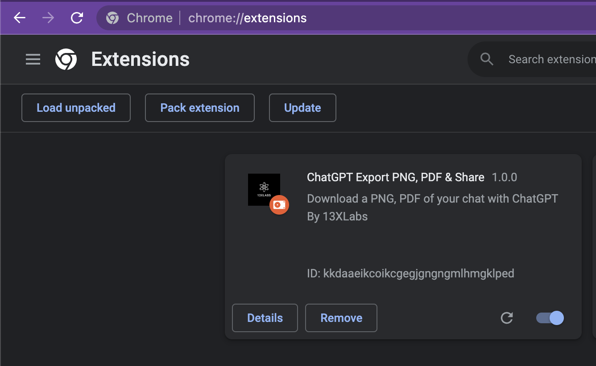

# 13XLabs Export PNG,PDF, ShareLink
13XLabs Export PNG,PDF, ShareLink is a tool developed by 13XLabs that allows users to export and conserve conversations generated by ChatGPT, a large language model developed by OpenAI. The tool can export conversations to PDF and PNG formats, making it easy for users to share their conversations with others in a readable and accessible format. Additionally, the tool provides users with a shareable link to their conversation, which can be used to easily share the conversation with others online.

This tool is particularly useful for researchers, developers, and anyone who wants to preserve and share their conversations with ChatGPT. Users can easily export their conversations and store them for future reference or share them with others.

 

## How to install it

### Install to Chrome/Edge

1. Download `chrome-chatgpt-v1.0.0.zip`
2. Unzip the downloaded file to extract the extension files.
3. In Chrome/Edge go to the extensions page (`chrome://extensions` or `edge://extensions`).
4. Enable Developer mode by clicking the toggle switch in the top right corner of the page.
5. Click the `Load unpacked` button and select the directory where you unzipped the extension files.
6. ChatGPT Export should now be installed and active on the ChatGPT website (https://chat.openai.com/chat).

  

  
## How to use it

After chatting with ChatGPT, you will notice new buttons at the bottom of the page (next to "Try Again"):
  

  
Look for them at the bottom of the page:
  

## Roadmap
- [X] Support Chrome

## Contribution
Thank you Liad Yosef. I would like to express my sincere gratitude for your contribution to the open-source community by providing the MIT license for your work on Github.
